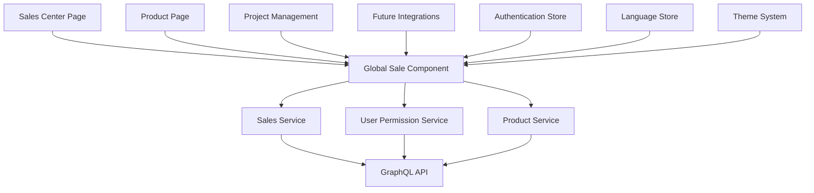

# Design Document - Global Sales System

## Overview

The Global Sales System transforms the existing project-specific sales functionality into a reusable, modular system that can be accessed from multiple locations within the application. The system maintains all existing functionality while adding new capabilities for centralized sales management and product-specific sales reporting.

## Architecture

### Current State Analysis

The existing sales functionality is tightly coupled to the project management interface (`src/lib/components/prPr/sale.svelte`) and relies on:
- Project-specific stores (`idPr`)
- Direct GraphQL mutations for sale creation
- Callback-based communication with parent components
- Hebrew/English localization support
- Royal gold design theme

### Target Architecture



## Components and Interfaces

### 1. Global Sale Component (`src/lib/components/sales/SaleComponent.svelte`)

**Purpose**: Reusable sale reporting component that can be used across the application.

**Props Interface**:
```typescript
interface SaleComponentProps {
  // Product information
  productId: string;
  productName: string;
  availableQuantity: number;
  price: number;
  kindOf: 'monthly' | 'yearly' | 'total' | 'unlimited';
  
  // Project context
  projectId: string;
  projectUsers: Array<{id: string, attributes: {username: string}}>;
  
  // Optional overrides
  each?: number;
  kindUlimit?: boolean;
  
  // Callbacks
  onDone?: (payload: {id: any, in: any, un: any, matana: any}) => void;
  onDoners?: () => void;
  onError?: () => void;
}
```

**Key Features**:
- Maintains all existing validation logic
- Supports all sale types (monthly, yearly, total, unlimited)
- Preserves date range functionality for recurring sales
- Includes user selection and quantity management
- Maintains royal gold styling

### 2. Sales Service (`src/lib/services/salesService.js`)

**Purpose**: Centralized business logic for sale operations.

**Functions**:
```typescript
interface SalesService {
  createSale(saleData: SaleData): Promise<SaleResult>;
  validateSaleData(saleData: SaleData): ValidationResult;
  calculateTotal(quantity: number, price: number, dateRange?: DateRange): number;
  getUserProjects(userId: string): Promise<Project[]>;
  getProjectProducts(projectId: string): Promise<Product[]>;
  getUserSellableProducts(userId: string): Promise<ProductWithProject[]>;
}
```

### 3. Sales Center Page (`src/routes/(reg)/sales-center/+page.svelte`)

**Purpose**: Centralized interface for managing sales across all user projects.

**Features**:
- Display all sellable products from user's projects
- Group products by project
- Filter and search functionality
- Bulk operations support
- Responsive design with royal gold theme

**Layout Structure**:
```
┌─────────────────────────────────────┐
│ Sales Center Header                 │
├─────────────────────────────────────┤
│ Filters & Search                    │
├─────────────────────────────────────┤
│ Project Group 1                     │
│ ├─ Product 1 [Sale Button]          │
│ ├─ Product 2 [Sale Button]          │
│ └─ Product 3 [Sale Button]          │
├─────────────────────────────────────┤
│ Project Group 2                     │
│ ├─ Product 4 [Sale Button]          │
│ └─ Product 5 [Sale Button]          │
└─────────────────────────────────────┘
```

### 4. Enhanced Product Page (`src/routes/gift/[id]/+page.svelte`)

**Purpose**: Add sale reporting capability to individual product pages for authorized users.

**New Features**:
- Check user membership in product's project
- Display sale reporting interface for project members
- Maintain existing "buy now" functionality for all users
- Update product quantity after successful sales

## Data Models

### Sale Data Structure
```typescript
interface SaleData {
  project: string;
  matanot: string;
  users_permissions_user: string;
  in: number;
  unit: number;
  date: string;
  publishedAt: string;
  startDate?: string;
  finishDate?: string;
}
```

### Product with Project Context
```typescript
interface ProductWithProject {
  id: string;
  attributes: {
    name: string;
    price: number;
    quant: number;
    kindOf: 'monthly' | 'yearly' | 'total' | 'unlimited';
    startDate?: string;
    finnishDate?: string;
    projectcreates: {
      data: [{
        id: string;
        attributes: {
          projectName: string;
          profilePic?: {data: {attributes: {url: string}}};
        }
      }]
    }
  }
}
```

## Error Handling

### Validation Layers
1. **Client-side validation**: Form validation, quantity checks, date validation
2. **Service-layer validation**: Business rule validation, permission checks
3. **API-level validation**: Data integrity, authentication verification

### Error Types
- **Authentication errors**: Invalid or expired tokens
- **Permission errors**: User not authorized for project
- **Validation errors**: Invalid quantities, dates, or user selections
- **Network errors**: API connectivity issues
- **Business logic errors**: Insufficient inventory, invalid sale types

### Error Recovery
- Automatic retry for network failures
- Clear error messages in Hebrew/English
- Graceful degradation for partial failures
- Rollback mechanisms for failed transactions

## Testing Strategy

### Unit Tests
- Sales service functions
- Validation logic
- Calculation functions
- Error handling scenarios

### Integration Tests
- Component interaction with services
- GraphQL mutation execution
- Authentication flow
- Permission checking

### End-to-End Tests
- Complete sale workflow from sales center
- Product page sale reporting
- Multi-language functionality
- Responsive design validation

## Implementation Phases

### Phase 1: Core Refactoring
- Extract sale logic into reusable component
- Create sales service layer
- Implement basic error handling
- Maintain backward compatibility

### Phase 2: Sales Center
- Create sales center page and routing
- Implement product aggregation logic
- Add filtering and search capabilities
- Integrate with existing authentication

### Phase 3: Product Page Enhancement
- Add permission checking logic
- Integrate sale component into product pages
- Implement quantity updates
- Add user feedback mechanisms

### Phase 4: Polish and Optimization
- Performance optimization
- Enhanced error handling
- Additional features (bulk operations, reporting)
- Comprehensive testing

## Security Considerations

### Authentication
- JWT token validation for all operations
- Session management and expiration handling
- Secure cookie handling

### Authorization
- Project membership verification
- Role-based access control
- Operation-level permissions

### Data Protection
- Input sanitization and validation
- SQL injection prevention
- XSS protection in user-generated content

## Performance Considerations

### Caching Strategy
- Cache user project memberships
- Cache product data with TTL
- Implement optimistic updates for better UX

### Database Optimization
- Efficient queries for product aggregation
- Proper indexing for user-project relationships
- Pagination for large product lists

### Frontend Optimization
- Lazy loading for product images
- Virtual scrolling for large lists
- Debounced search functionality

## Localization

### Language Support
- Maintain existing Hebrew/English support
- Consistent translation keys across components
- RTL layout support for Hebrew

### Cultural Considerations
- Date format localization
- Number format localization
- Currency display preferences