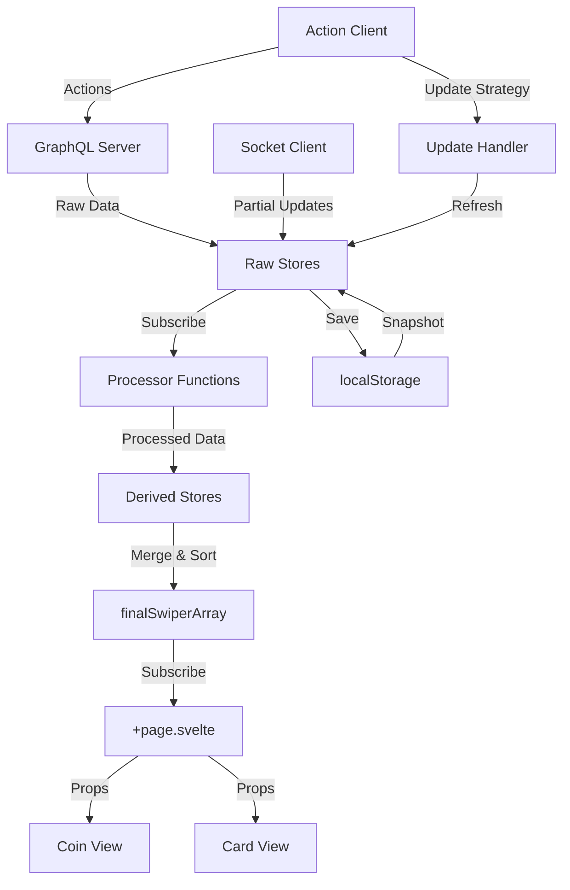
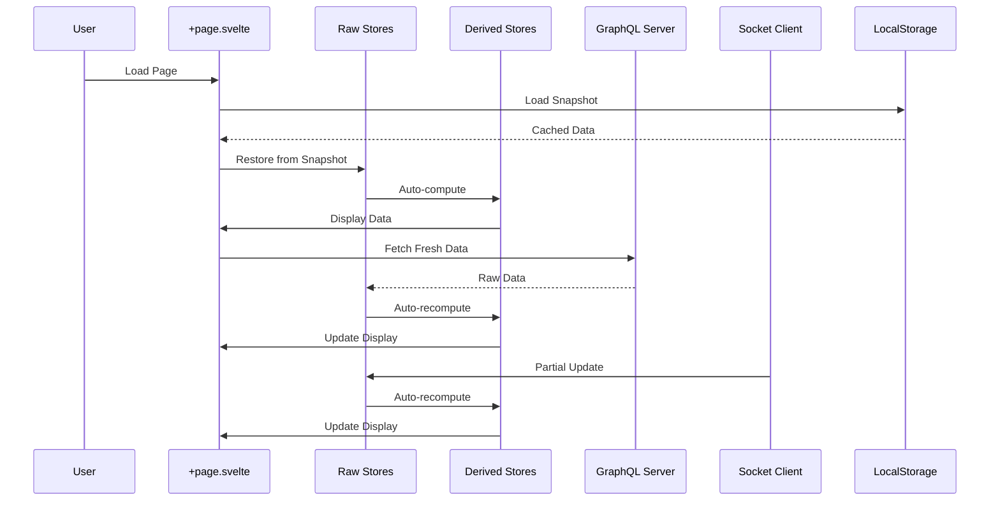

# Design Document - Lev Page Refactor

## Overview

המסמך הזה מתאר את הארכיטקטורה החדשה של עמוד הלב, המבוססת על עקרונות של:
- **Separation of Concerns** - הפרדה ברורה בין raw data, processing, ו-presentation
- **Reactive Programming** - שימוש ב-Svelte stores ו-derived stores
- **Pure Functions** - כל העיבודים בפונקציות טהורות ללא side effects
- **Integration** - אינטגרציה מלאה עם מערכת הפעולות המאוחדת
- **Performance** - טעינה מהירה, עדכונים חלקיים, ו-memoization

הארכיטקטורה החדשה תחליף את הקוד הנוכחי ב-+page.svelte שמכיל למעלה מ-2000 שורות של לוגיקה מעורבת.

## Architecture

### High-Level Architecture



### Data Flow




## Components and Interfaces

### 1. Raw Stores (levStores.ts)

Raw stores מכילים נתונים גולמיים כפי שהתקבלו מהשרת, ללא עיבוד.

```typescript
// src/lib/stores/levStores.ts
import { writable, type Writable } from 'svelte/store';

// ========== Raw Data Stores ==========

/** User profile data */
export const userStore: Writable<UserData | null> = writable(null);

/** All projects the user is member of */
export const projectsStore: Writable<ProjectData[]> = writable([]);

/** Pending missions (pends) */
export const pendsStore: Writable<PendMissionData[]> = writable([]);

/** Missions in progress (mtaha) */
export const mtahaStore: Writable<InProgressMissionData[]> = writable([]);

/** Mission approval requests (fiapp) */
export const fiappStore: Writable<ApprovalData[]> = writable([]);

/** Join requests to missions (askedcoin) */
export const askedStore: Writable<AskData[]> = writable([]);

/** Suggested missions (meData) */
export const suggestionsStore: Writable<SuggestionData[]> = writable([]);

/** Pending resources (pmashes) */
export const pmashesStore: Writable<PendResourceData[]> = writable([]);

/** Resource requests (wegets) */
export const wegetsStore: Writable<ResourceRequestData[]> = writable([]);

/** Profit distribution requests (haluask) */
export const halukasStore: Writable<HalukaData[]> = writable([]);

/** Welcome messages (walcomen) */
export const welcomeStore: Writable<WelcomeData[]> = writable([]);

/** Money transfers (tverias) */
export const transfersStore: Writable<TransferData[]> = writable([]);

/** Decisions (hachlatot) */
export const decisionsStore: Writable<DecisionData[]> = writable([]);

// ========== UI State Stores ==========

/** Current view mode: true = cards, false = coins */
export const isCardsView: Writable<boolean> = writable(true);

/** Filter configuration for what to display */
export const milon: Writable<MilonConfig> = writable({
  hachla: true,   // החלטות
  fiap: true,     // אישורים
  welc: true,     // ברוכים הבאים
  sugg: true,     // הצעות
  pend: true,     // ממתינים
  asks: true,     // בקשות
  betaha: true,   // בתהליך
  desi: true,     // החלטות
  ppmash: true,   // משאבים ממתינים
  pmashs: true,   // הצעות משאבים
  pmaap: true,    // בקשות משאבים
  askmap: true    // בקשות משאבים ממני
});

/** Current project filter (null = all projects) */
export const projectFilter: Writable<string | null> = writable(null);

// ========== Snapshot Helpers ==========

export interface SnapshotData {
  version: number;
  timestamp: number;
  data: {
    user: UserData | null;
    projects: ProjectData[];
    pends: PendMissionData[];
    mtaha: InProgressMissionData[];
    // ... all other stores
  };
}

export function saveSnapshot(data: SnapshotData): void {
  try {
    localStorage.setItem('levSnapshot', JSON.stringify(data));
  } catch (e) {
    console.error('Failed to save snapshot:', e);
  }
}

export function loadSnapshot(): SnapshotData | null {
  try {
    const stored = localStorage.getItem('levSnapshot');
    if (!stored) return null;
    return JSON.parse(stored);
  } catch (e) {
    console.error('Failed to load snapshot:', e);
    return null;
  }
}

export function clearSnapshot(): void {
  localStorage.removeItem('levSnapshot');
}
```


### 2. Derived Stores (levDerived.ts)

Derived stores מעבדים את ה-raw data ומחזירים אובייקטים מוכנים לתצוגה.

```typescript
// src/lib/stores/levDerived.ts
import { derived, type Readable } from 'svelte/store';
import {
  pendsStore,
  mtahaStore,
  fiappStore,
  askedStore,
  suggestionsStore,
  pmashesStore,
  wegetsStore,
  halukasStore,
  welcomeStore,
  transfersStore,
  decisionsStore,
  projectsStore,
  milon,
  projectFilter
} from './levStores';
import {
  processPends,
  processMtaha,
  processFiapp,
  processAsked,
  processSuggestions,
  processPmashes,
  processWegets,
  processHalukas,
  processWelcome,
  processTransfers,
  processDecisions,
  mergeAndSort
} from '$lib/utils/levProcessors';

// ========== Individual Processed Stores ==========

export const processedPends: Readable<DisplayItem[]> = derived(
  [pendsStore, projectsStore],
  ([$pends, $projects]) => processPends($pends, $projects)
);

export const processedMtaha: Readable<DisplayItem[]> = derived(
  [mtahaStore, projectsStore],
  ([$mtaha, $projects]) => processMtaha($mtaha, $projects)
);

export const processedFiapp: Readable<DisplayItem[]> = derived(
  [fiappStore, projectsStore],
  ([$fiapp, $projects]) => processFiapp($fiapp, $projects)
);

export const processedAsked: Readable<DisplayItem[]> = derived(
  [askedStore, projectsStore],
  ([$asked, $projects]) => processAsked($asked, $projects)
);

export const processedSuggestions: Readable<DisplayItem[]> = derived(
  [suggestionsStore, projectsStore],
  ([$suggestions, $projects]) => processSuggestions($suggestions, $projects)
);

export const processedPmashes: Readable<DisplayItem[]> = derived(
  [pmashesStore, projectsStore],
  ([$pmashes, $projects]) => processPmashes($pmashes, $projects)
);

export const processedWegets: Readable<DisplayItem[]> = derived(
  [wegetsStore, projectsStore],
  ([$wegets, $projects]) => processWegets($wegets, $projects)
);

export const processedHalukas: Readable<DisplayItem[]> = derived(
  [halukasStore, projectsStore],
  ([$halukas, $projects]) => processHalukas($halukas, $projects)
);

export const processedWelcome: Readable<DisplayItem[]> = derived(
  [welcomeStore, projectsStore],
  ([$welcome, $projects]) => processWelcome($welcome, $projects)
);

export const processedTransfers: Readable<DisplayItem[]> = derived(
  [transfersStore, projectsStore],
  ([$transfers, $projects]) => processTransfers($transfers, $projects)
);

export const processedDecisions: Readable<DisplayItem[]> = derived(
  [decisionsStore, projectsStore],
  ([$decisions, $projects]) => processDecisions($decisions, $projects)
);

// ========== Final Merged Array ==========

/**
 * The main array that combines all processed items, sorted by priority.
 * This replaces the old arr1 array.
 */
export const finalSwiperArray: Readable<DisplayItem[]> = derived(
  [
    processedPends,
    processedMtaha,
    processedFiapp,
    processedAsked,
    processedSuggestions,
    processedPmashes,
    processedWegets,
    processedHalukas,
    processedWelcome,
    processedTransfers,
    processedDecisions,
    milon,
    projectFilter
  ],
  ([
    $pends,
    $mtaha,
    $fiapp,
    $asked,
    $suggestions,
    $pmashes,
    $wegets,
    $halukas,
    $welcome,
    $transfers,
    $decisions,
    $milon,
    $projectFilter
  ]) => {
    // Merge all arrays
    const merged = mergeAndSort(
      $pends,
      $mtaha,
      $fiapp,
      $asked,
      $suggestions,
      $pmashes,
      $wegets,
      $halukas,
      $welcome,
      $transfers,
      $decisions
    );
    
    // Apply filters
    let filtered = merged;
    
    // Filter by milon (visibility settings)
    filtered = filtered.filter(item => {
      switch (item.ani) {
        case 'pends': return $milon.pend;
        case 'mtaha': return $milon.betaha;
        case 'fiapp': return $milon.fiap;
        case 'askedcoin': return $milon.asks;
        case 'meData': return $milon.sugg;
        case 'pmashes': return $milon.ppmash;
        case 'wegets': return $milon.pmaap;
        case 'haluk': return $milon.desi;
        case 'walcomen': return $milon.welc;
        case 'vidu': return true; // Always show transfers
        case 'hachla': return $milon.hachla;
        default: return true;
      }
    });
    
    // Filter by project
    if ($projectFilter !== null) {
      filtered = filtered.filter(item => item.projectId === $projectFilter);
    }
    
    return filtered;
  }
);
```


### 3. Processor Functions (levProcessors.ts)

פונקציות טהורות שמעבדות raw data ל-display items.

```typescript
// src/lib/utils/levProcessors.ts

/**
 * Common interface for all display items.
 * This is what gets rendered in both coin and card views.
 */
export interface DisplayItem {
  ani: string;           // Type identifier (pends, mtaha, etc.)
  azmi: string;          // Category (mesima, harchava, etc.)
  pl: number;            // Priority for sorting
  coinlapach: string;    // Unique identifier
  projectId: string;     // Project ID
  projectName: string;   // Project name
  src: string;           // Project image URL
  [key: string]: any;    // Additional type-specific fields
}

/**
 * Process pending missions into display items
 */
export function processPends(
  pends: PendMissionData[],
  projects: ProjectData[]
): DisplayItem[] {
  return pends.map(pend => {
    const project = projects.find(p => p.id === pend.projectId);
    
    return {
      ani: 'pends',
      azmi: 'mesima',
      pl: pend.priority ?? 100,
      coinlapach: `pend-${pend.id}`,
      projectId: pend.projectId,
      projectName: project?.attributes.projectName ?? '',
      src: project?.attributes.profilePic?.data?.attributes?.url ?? '',
      
      // Pend-specific fields
      pendId: pend.id,
      name: pend.name,
      users: pend.users,
      noofusersOk: pend.users.filter(u => u.what === true).length,
      noofusersNo: pend.users.filter(u => u.what === false).length,
      noofusersWaiting: (project?.attributes.user_1s?.data?.length ?? 0) - pend.users.length,
      messege: pend.messages,
      // ... other pend fields
    };
  });
}

/**
 * Process missions in progress into display items
 */
export function processMtaha(
  mtaha: InProgressMissionData[],
  projects: ProjectData[]
): DisplayItem[] {
  return mtaha.map(mission => {
    const project = projects.find(p => p.id === mission.projectId);
    
    return {
      ani: 'mtaha',
      azmi: 'mesima',
      pl: mission.priority ?? 150,
      coinlapach: `mtaha-${mission.id}`,
      projectId: mission.projectId,
      projectName: project?.attributes.projectName ?? '',
      src: project?.attributes.profilePic?.data?.attributes?.url ?? '',
      
      // Mtaha-specific fields
      missionId: mission.id,
      name: mission.name,
      assignedTo: mission.assignedTo,
      progress: mission.progress,
      // ... other mtaha fields
    };
  });
}

/**
 * Merge all processed arrays and sort by priority
 */
export function mergeAndSort(...arrays: DisplayItem[][]): DisplayItem[] {
  const merged = arrays.flat();
  return merged.sort((a, b) => (a.pl ?? 999) - (b.pl ?? 999));
}

// ... Similar processor functions for other types:
// - processFiapp
// - processAsked
// - processSuggestions
// - processPmashes
// - processWegets
// - processHalukas
// - processWelcome
// - processTransfers
// - processDecisions
```


### 4. Data Loading & Initialization

```typescript
// src/lib/utils/levDataLoader.ts

import { get } from 'svelte/store';
import {
  userStore,
  projectsStore,
  pendsStore,
  mtahaStore,
  // ... all other stores
  saveSnapshot,
  loadSnapshot,
  type SnapshotData
} from '$lib/stores/levStores';
import { fetchMainUserData } from './levGraphQLQueries';

const CURRENT_VERSION = 2; // Increment when data structure changes

/**
 * Initialize stores from snapshot or fetch fresh data
 */
export async function initializeLevData(
  userId: string,
  token: string,
  lang: string
): Promise<void> {
  // Try to load from snapshot first
  const snapshot = loadSnapshot();
  
  if (snapshot && snapshot.version === CURRENT_VERSION) {
    console.log('Loading from snapshot');
    restoreFromSnapshot(snapshot);
  }
  
  // Fetch fresh data from server
  console.log('Fetching fresh data');
  const freshData = await fetchMainUserData(
    import.meta.env.VITE_URL,
    token,
    userId,
    lang
  );
  
  // Update all stores
  populateStores(freshData);
  
  // Save new snapshot
  saveCurrentSnapshot();
}

/**
 * Restore all stores from snapshot
 */
function restoreFromSnapshot(snapshot: SnapshotData): void {
  userStore.set(snapshot.data.user);
  projectsStore.set(snapshot.data.projects);
  pendsStore.set(snapshot.data.pends);
  mtahaStore.set(snapshot.data.mtaha);
  // ... restore all other stores
}

/**
 * Populate stores from GraphQL response
 */
function populateStores(data: any): void {
  const userData = data.data.usersPermissionsUser.data;
  
  // User data
  userStore.set({
    id: userData.id,
    username: userData.attributes.username,
    email: userData.attributes.email,
    profilePic: userData.attributes.profilePic?.data?.attributes?.url,
    // ... other user fields
  });
  
  // Projects
  projectsStore.set(userData.attributes.projects_1s.data);
  
  // Pends
  const pends = extractPends(userData);
  pendsStore.set(pends);
  
  // Mtaha
  const mtaha = extractMtaha(userData);
  mtahaStore.set(mtaha);
  
  // ... populate all other stores
}

/**
 * Save current state to snapshot
 */
function saveCurrentSnapshot(): void {
  const snapshot: SnapshotData = {
    version: CURRENT_VERSION,
    timestamp: Date.now(),
    data: {
      user: get(userStore),
      projects: get(projectsStore),
      pends: get(pendsStore),
      mtaha: get(mtahaStore),
      // ... all other stores
    }
  };
  
  saveSnapshot(snapshot);
}

/**
 * Extract pends from raw GraphQL data
 */
function extractPends(userData: any): PendMissionData[] {
  const pends: PendMissionData[] = [];
  
  for (const project of userData.attributes.projects_1s.data) {
    for (const pend of project.attributes.pendms.data) {
      pends.push({
        id: pend.id,
        projectId: project.id,
        name: pend.attributes.name,
        users: pend.attributes.users,
        messages: pend.attributes.diun,
        // ... other pend fields
      });
    }
  }
  
  return pends;
}

// Similar extraction functions for other data types
```


### 5. Socket Integration & Partial Updates

```typescript
// src/lib/utils/levSocketHandler.ts

import { get } from 'svelte/store';
import { socketClient } from '$lib/stores/socketClient';
import {
  pendsStore,
  pmashesStore,
  askedStore,
  // ... other stores
} from '$lib/stores/levStores';
import { initializeLevData } from './levDataLoader';

/**
 * Setup socket listeners for partial updates
 */
export function setupSocketListeners(
  userId: string,
  token: string,
  lang: string
): () => void {
  // Listen for notifications from unified action system
  const unsubscribe = socketClient.onNotification(async (notification) => {
    console.log('🔔 [LEV] Received notification:', notification);
    
    const { actionKey, updateStrategy, data } = notification;
    
    // Handle different update strategies
    switch (updateStrategy?.type) {
      case 'fullRefresh':
        console.log('📥 [LEV] Full refresh triggered');
        await initializeLevData(userId, token, lang);
        break;
        
      case 'partialUpdate':
        console.log('🔄 [LEV] Partial update triggered');
        handlePartialUpdate(updateStrategy.config?.dataKeys, data);
        break;
        
      case 'optimistic':
        console.log('⚡ [LEV] Optimistic update - already applied');
        // UI already updated optimistically, no action needed
        break;
        
      default:
        console.log('📢 [LEV] Notification only');
        // No update strategy, just a notification
        break;
    }
  });
  
  return unsubscribe;
}

/**
 * Handle partial update of specific stores
 */
function handlePartialUpdate(dataKeys: string[] | undefined, data: any): void {
  if (!dataKeys) {
    console.warn('No dataKeys specified for partial update');
    return;
  }
  
  for (const key of dataKeys) {
    switch (key) {
      case 'pends':
        updatePendsStore(data);
        break;
      case 'pmashes':
        updatePmashesStore(data);
        break;
      case 'asked':
        updateAskedStore(data);
        break;
      // ... other stores
    }
  }
}

/**
 * Update pends store with new/modified item
 */
function updatePendsStore(data: any): void {
  pendsStore.update(current => {
    const index = current.findIndex(p => p.id === data.id);
    
    if (index !== -1) {
      // Update existing item
      current[index] = { ...current[index], ...data };
    } else {
      // Add new item
      current.push(data);
    }
    
    return [...current];
  });
}

/**
 * Update pmashes store with new/modified item
 */
function updatePmashesStore(data: any): void {
  pmashesStore.update(current => {
    const index = current.findIndex(p => p.id === data.id);
    
    if (index !== -1) {
      // Update existing item
      current[index] = { ...current[index], ...data };
    } else {
      // Add new item
      current.push(data);
    }
    
    return [...current];
  });
}

// Similar update functions for other stores
```


### 6. Page Component (+page.svelte)

הקומפוננטה הראשית תהיה הרבה יותר פשוטה ונקייה.

```svelte
<!-- src/routes/(reg)/lev/+page.svelte -->
<script>
  import { onMount, onDestroy } from 'svelte';
  import { page } from '$app/state';
  import { goto } from '$app/navigation';
  import { toast } from 'svelte-sonner';
  import { lang, locale, langUs, doesLang } from '$lib/stores/lang.js';
  import { finalSwiperArray, isCardsView } from '$lib/stores/levDerived';
  import { initializeLevData } from '$lib/utils/levDataLoader';
  import { setupSocketListeners } from '$lib/utils/levSocketHandler';
  import Coinsui from '$lib/components/lev/newcoinui.svelte';
  import Cardsui from '$lib/components/lev/cards/cards.svelte';
  import { RingLoader } from 'svelte-loading-spinners';
  
  let { data } = $props();
  
  let loading = $state(true);
  let error = $state(null);
  let unsubscribeSocket = null;
  
  // Subscribe to finalSwiperArray
  let displayItems = $state([]);
  $effect(() => {
    displayItems = $finalSwiperArray;
  });
  
  // Subscribe to view mode
  let cards = $state(true);
  $effect(() => {
    cards = $isCardsView;
  });
  
  onMount(async () => {
    // Sync language stores
    lang.set(data.lang);
    locale.set(data.lang);
    langUs.set(data.lang);
    doesLang.set(true);
    
    // Check authentication
    if (!page.data.tok) {
      goto('/');
      return;
    }
    
    try {
      // Initialize data
      await initializeLevData(
        page.data.uid,
        page.data.tok,
        data.lang
      );
      
      // Setup socket listeners
      unsubscribeSocket = setupSocketListeners(
        page.data.uid,
        page.data.tok,
        data.lang
      );
      
      loading = false;
    } catch (e) {
      console.error('Failed to initialize lev page:', e);
      error = e.message;
      toast.error('Failed to load data');
    }
  });
  
  onDestroy(() => {
    if (unsubscribeSocket) {
      unsubscribeSocket();
    }
  });
  
  function handleViewChange(event) {
    isCardsView.set(event.cards);
  }
  
  function handleCoinLapach(event) {
    // Remove item from display
    displayItems = displayItems.filter(
      item => item.coinlapach !== event.coinlapach
    );
    
    // Optionally refresh data
    // await initializeLevData(...);
  }
</script>

{#if loading}
  <div class="loading-container">
    <RingLoader size="60" color="#ff00ff" />
  </div>
{:else if error}
  <div class="error-container">
    <p>Error: {error}</p>
  </div>
{:else if cards}
  <Cardsui 
    arr1={displayItems} 
    onCards={handleViewChange}
    onStart={handleCoinLapach}
  />
{:else}
  <Coinsui 
    arr1={displayItems} 
    onCards={handleViewChange}
    onStart={handleCoinLapach}
  />
{/if}

<style>
  .loading-container {
    display: flex;
    justify-content: center;
    align-items: center;
    height: 100vh;
  }
  
  .error-container {
    display: flex;
    justify-content: center;
    align-items: center;
    height: 100vh;
    color: red;
  }
</style>
```


## Data Models

### Raw Data Types

```typescript
// User Data
export interface UserData {
  id: string;
  username: string;
  email: string;
  profilePic?: string;
  lang: string;
  total: number;
}

// Project Data
export interface ProjectData {
  id: string;
  attributes: {
    projectName: string;
    profilePic?: {
      data?: {
        attributes: {
          url: string;
        };
      };
    };
    user_1s: {
      data: Array<{ id: string }>;
    };
  };
}

// Pending Mission Data
export interface PendMissionData {
  id: string;
  projectId: string;
  name: string;
  users: Array<{
    users_permissions_user: { data: { id: string } };
    what: boolean;
    order?: number;
  }>;
  messages: any[];
  priority?: number;
}

// Mission In Progress Data
export interface InProgressMissionData {
  id: string;
  projectId: string;
  name: string;
  assignedTo: string;
  progress: number;
  priority?: number;
}

// ... Similar interfaces for all other data types
```

### Display Item Type

```typescript
export interface DisplayItem {
  // Common fields (required for all items)
  ani: string;           // Type: pends, mtaha, fiapp, etc.
  azmi: string;          // Category: mesima, harchava, etc.
  pl: number;            // Priority for sorting
  coinlapach: string;    // Unique identifier
  projectId: string;     // Project ID
  projectName: string;   // Project name
  src: string;           // Project image URL
  
  // Type-specific fields (optional, depends on ani)
  [key: string]: any;
}
```

### Filter Configuration

```typescript
export interface MilonConfig {
  hachla: boolean;   // Show decisions
  fiap: boolean;     // Show approvals
  welc: boolean;     // Show welcomes
  sugg: boolean;     // Show suggestions
  pend: boolean;     // Show pending
  asks: boolean;     // Show requests
  betaha: boolean;   // Show in progress
  desi: boolean;     // Show decisions
  ppmash: boolean;   // Show pending resources
  pmashs: boolean;   // Show resource suggestions
  pmaap: boolean;    // Show resource requests
  askmap: boolean;   // Show my resource requests
}
```


## Correctness Properties

*A property is a characteristic or behavior that should hold true across all valid executions of a system-essentially, a formal statement about what the system should do. Properties serve as the bridge between human-readable specifications and machine-verifiable correctness guarantees.*

**Property 1: Raw Data Immutability**
*For any* raw data received from GraphQL, storing it in a raw store should preserve the data exactly as received without any transformation or modification
**Validates: Requirements 1.1**

**Property 2: Processor Function Purity**
*For any* processor function and input data, calling the function multiple times with the same input should always return the same output, and the input data should remain unchanged
**Validates: Requirements 2.1, 2.2**

**Property 3: Derived Store Reactivity**
*For any* change to a raw store, all derived stores that depend on it should automatically recompute, and the finalSwiperArray should reflect the change
**Validates: Requirements 1.3, 3.1, 3.2**

**Property 4: Snapshot Loading Priority**
*For any* page load with a valid snapshot, the system should display the snapshot data before fetching from the server, ensuring fast initial render
**Validates: Requirements 4.1, 4.2**

**Property 5: Partial Update Precision**
*For any* socket event with partial update data, only the specific item mentioned in the event should be updated in the raw store, leaving all other items unchanged
**Validates: Requirements 5.1, 5.2**

**Property 6: Action Client Integration**
*For any* user action, the system should use actionClient.execute and receive an updateStrategy in the response
**Validates: Requirements 7.1, 7.2**

**Property 7: Derived Store Efficiency**
*For any* derived store, it should only recompute when its dependencies actually change, not on every store update
**Validates: Requirements 12.1**

**Property 8: Backward Compatibility**
*For any* set of input data, the new architecture should produce the same finalSwiperArray as the old arr1 array (same items, same order, same fields)
**Validates: Requirements 13.1**


## Error Handling

### Error Categories

1. **Snapshot Errors**
   - Corrupted snapshot data
   - Version mismatch
   - localStorage quota exceeded
   - Strategy: Log error, clear snapshot, fetch fresh data

2. **GraphQL Errors**
   - Network failure
   - Authentication expired
   - Invalid response format
   - Strategy: Show error toast, redirect to login if auth failed

3. **Socket Errors**
   - Connection lost
   - Invalid event format
   - Update conflicts
   - Strategy: Log error, continue with cached data, attempt reconnect

4. **Processor Errors**
   - Invalid input data
   - Missing required fields
   - Type mismatches
   - Strategy: Log error, skip invalid item, continue processing others

5. **Component Errors**
   - Rendering failures
   - Invalid props
   - Strategy: Error boundary, show fallback UI

### Error Recovery

```typescript
// Example error handling in data loader
export async function initializeLevData(
  userId: string,
  token: string,
  lang: string
): Promise<void> {
  try {
    // Try snapshot first
    const snapshot = loadSnapshot();
    if (snapshot && snapshot.version === CURRENT_VERSION) {
      try {
        restoreFromSnapshot(snapshot);
      } catch (e) {
        console.error('Snapshot restore failed:', e);
        clearSnapshot();
      }
    }
    
    // Fetch fresh data
    const freshData = await fetchMainUserData(
      import.meta.env.VITE_URL,
      token,
      userId,
      lang
    );
    
    populateStores(freshData);
    saveCurrentSnapshot();
    
  } catch (e) {
    console.error('Failed to initialize lev data:', e);
    
    // Check if auth error
    if (e.message.includes('401') || e.message.includes('403')) {
      toast.warning('Session expired, redirecting to login');
      goto('/login?from=/lev');
      return;
    }
    
    // Other errors - show toast but keep cached data if available
    toast.error('Failed to load fresh data, showing cached data');
    throw e;
  }
}
```

## Testing Strategy

### Unit Testing

1. **Processor Functions**
   - Test each processor with various input data
   - Test edge cases (empty arrays, null values, missing fields)
   - Test that input data is not modified
   - Test that output format is correct

2. **Store Operations**
   - Test snapshot save/load/clear
   - Test store updates
   - Test derived store computations

3. **Data Extraction**
   - Test extraction functions with various GraphQL responses
   - Test handling of missing/optional fields

### Property-Based Testing

Using **fast-check** for TypeScript, minimum 100 iterations per test.

**Property Test 1: Processor Purity**
```typescript
// Feature: lev-page-refactor, Property 2: Processor Function Purity
// Validates: Requirements 2.1, 2.2

import fc from 'fast-check';

test('processor functions are pure', () => {
  fc.assert(
    fc.property(
      fc.array(fc.record({
        id: fc.string(),
        projectId: fc.string(),
        name: fc.string(),
        priority: fc.integer()
      })),
      fc.array(fc.record({
        id: fc.string(),
        attributes: fc.record({
          projectName: fc.string()
        })
      })),
      (pends, projects) => {
        // Call processor twice with same input
        const result1 = processPends(pends, projects);
        const result2 = processPends(pends, projects);
        
        // Results should be equal
        expect(result1).toEqual(result2);
        
        // Input should not be modified
        expect(pends).toEqual(pends);
        expect(projects).toEqual(projects);
      }
    ),
    { numRuns: 100 }
  );
});
```

**Property Test 2: Derived Store Reactivity**
```typescript
// Feature: lev-page-refactor, Property 3: Derived Store Reactivity
// Validates: Requirements 1.3, 3.1, 3.2

test('derived stores react to raw store changes', () => {
  fc.assert(
    fc.property(
      fc.array(fc.record({
        id: fc.string(),
        projectId: fc.string(),
        name: fc.string()
      })),
      (newPends) => {
        let updateCount = 0;
        
        // Subscribe to derived store
        const unsubscribe = processedPends.subscribe(() => {
          updateCount++;
        });
        
        // Update raw store
        pendsStore.set(newPends);
        
        // Derived store should have updated
        expect(updateCount).toBeGreaterThan(0);
        
        unsubscribe();
      }
    ),
    { numRuns: 100 }
  );
});
```

**Property Test 3: Partial Update Precision**
```typescript
// Feature: lev-page-refactor, Property 5: Partial Update Precision
// Validates: Requirements 5.1, 5.2

test('partial updates only modify specific items', () => {
  fc.assert(
    fc.property(
      fc.array(fc.record({
        id: fc.string(),
        name: fc.string()
      }), { minLength: 3 }),
      fc.integer({ min: 0, max: 2 }),
      fc.record({ name: fc.string() }),
      (initialData, updateIndex, updateData) => {
        // Set initial data
        pendsStore.set(initialData);
        
        // Update specific item
        const itemToUpdate = initialData[updateIndex];
        updatePendsStore({
          id: itemToUpdate.id,
          ...updateData
        });
        
        // Get current state
        const current = get(pendsStore);
        
        // Only the updated item should change
        for (let i = 0; i < current.length; i++) {
          if (i === updateIndex) {
            expect(current[i].name).toBe(updateData.name);
          } else {
            expect(current[i]).toEqual(initialData[i]);
          }
        }
      }
    ),
    { numRuns: 100 }
  );
});
```

### Integration Testing

1. **Full Data Flow**
   - Test complete flow from GraphQL to display
   - Test snapshot save/restore cycle
   - Test socket updates triggering UI changes

2. **Component Integration**
   - Test +page.svelte with real stores
   - Test view switching (coins/cards)
   - Test item removal

3. **Action Integration**
   - Test actions triggering updates
   - Test updateStrategy handling
   - Test optimistic updates


## Migration Strategy

### Phase 1: Infrastructure (Week 1)

1. Create store files (levStores.ts, levDerived.ts)
2. Create processor functions (levProcessors.ts)
3. Create data loader (levDataLoader.ts)
4. Write unit tests for processors
5. No UI changes yet

### Phase 2: Parallel Implementation (Week 2)

1. Create new +page.svelte alongside old one
2. Use feature flag to switch between implementations
3. Test new implementation thoroughly
4. Compare output with old implementation

### Phase 3: Socket Integration (Week 3)

1. Implement socket handler (levSocketHandler.ts)
2. Test partial updates
3. Test integration with unified action system
4. Verify no regressions

### Phase 4: Migration (Week 4)

1. Enable new implementation for beta users
2. Monitor for errors and performance
3. Collect feedback
4. Fix any issues found

### Phase 5: Cleanup (Week 5)

1. Switch all users to new implementation
2. Remove old code
3. Remove feature flag
4. Update documentation

### Feature Flag Implementation

```typescript
// src/lib/stores/featureFlags.ts
export const USE_NEW_LEV_ARCHITECTURE = writable(
  localStorage.getItem('useNewLevArchitecture') === 'true'
);

// In +page.svelte
{#if $USE_NEW_LEV_ARCHITECTURE}
  <!-- New implementation -->
{:else}
  <!-- Old implementation -->
{/if}
```

### Rollback Plan

If critical issues are found:
1. Disable feature flag immediately
2. All users revert to old implementation
3. Fix issues in new implementation
4. Re-enable for testing

## Performance Considerations

### Optimization Techniques

1. **Memoization**
   - Derived stores automatically memoize
   - Only recompute when dependencies change
   - Svelte's reactivity handles this

2. **Lazy Loading**
   - Load snapshot first (instant)
   - Fetch fresh data in background
   - Update UI when ready

3. **Partial Updates**
   - Socket events update only changed items
   - Avoid full data refetch
   - Derived stores recompute efficiently

4. **Batching**
   - Multiple socket events can be batched
   - Single recomputation for multiple changes
   - Use debouncing if needed

5. **Component Keys**
   - Use coinlapach as key in Swiper
   - Svelte only re-renders changed items
   - Avoid full list re-render

### Performance Metrics

Track these metrics:

1. **Initial Load Time**
   - Time to first render (with snapshot)
   - Time to fresh data
   - Target: < 100ms for snapshot, < 1s for fresh data

2. **Update Time**
   - Time from socket event to UI update
   - Target: < 50ms

3. **Memory Usage**
   - Store size in memory
   - Snapshot size in localStorage
   - Target: < 5MB total

4. **Recomputation Count**
   - Number of derived store recomputations
   - Should be minimal (only on actual changes)

### Performance Testing

```typescript
// Example performance test
test('initial load performance', async () => {
  const startTime = performance.now();
  
  // Load snapshot
  const snapshot = loadSnapshot();
  restoreFromSnapshot(snapshot);
  
  const snapshotTime = performance.now() - startTime;
  expect(snapshotTime).toBeLessThan(100); // < 100ms
  
  // Fetch fresh data
  const fetchStart = performance.now();
  await initializeLevData(userId, token, lang);
  const fetchTime = performance.now() - fetchStart;
  
  expect(fetchTime).toBeLessThan(1000); // < 1s
});
```

## File Structure

```
src/
├── lib/
│   ├── stores/
│   │   ├── levStores.ts          # Raw stores + snapshot helpers
│   │   └── levDerived.ts         # Derived stores + finalSwiperArray
│   ├── utils/
│   │   ├── levProcessors.ts      # Pure processor functions
│   │   ├── levDataLoader.ts      # Data loading & initialization
│   │   ├── levSocketHandler.ts   # Socket event handling
│   │   └── levGraphQLQueries.ts  # GraphQL queries (existing)
│   └── components/
│       └── lev/
│           ├── newcoinui.svelte  # Coin view (existing)
│           └── cards/
│               └── cards.svelte  # Card view (existing)
└── routes/
    └── (reg)/
        └── lev/
            └── +page.svelte      # Main page component (refactored)
```

## Developer Guide

### Adding a New Data Type

1. **Add Raw Store** (levStores.ts)
```typescript
export const newTypeStore: Writable<NewTypeData[]> = writable([]);
```

2. **Add Processor** (levProcessors.ts)
```typescript
export function processNewType(
  data: NewTypeData[],
  projects: ProjectData[]
): DisplayItem[] {
  return data.map(item => ({
    ani: 'newtype',
    azmi: 'category',
    pl: item.priority ?? 500,
    coinlapach: `newtype-${item.id}`,
    projectId: item.projectId,
    projectName: projects.find(p => p.id === item.projectId)?.attributes.projectName ?? '',
    src: projects.find(p => p.id === item.projectId)?.attributes.profilePic?.data?.attributes?.url ?? '',
    // ... type-specific fields
  }));
}
```

3. **Add Derived Store** (levDerived.ts)
```typescript
export const processedNewType: Readable<DisplayItem[]> = derived(
  [newTypeStore, projectsStore],
  ([$newType, $projects]) => processNewType($newType, $projects)
);
```

4. **Add to finalSwiperArray** (levDerived.ts)
```typescript
export const finalSwiperArray: Readable<DisplayItem[]> = derived(
  [
    // ... existing stores
    processedNewType,
    milon,
    projectFilter
  ],
  ([
    // ... existing params
    $newType,
    $milon,
    $projectFilter
  ]) => {
    const merged = mergeAndSort(
      // ... existing arrays
      $newType
    );
    // ... filtering logic
  }
);
```

5. **Add Extraction** (levDataLoader.ts)
```typescript
function extractNewType(userData: any): NewTypeData[] {
  // Extract from GraphQL response
}
```

6. **Add Socket Handler** (levSocketHandler.ts)
```typescript
function updateNewTypeStore(data: any): void {
  newTypeStore.update(current => {
    // Update logic
  });
}
```

## Conclusion

הארכיטקטורה החדשה מספקת:
- ✅ הפרדת אחריות ברורה
- ✅ קוד testable ו-maintainable
- ✅ ביצועים משופרים
- ✅ אינטגרציה מלאה עם מערכת הפעולות
- ✅ עדכונים חלקיים יעילים
- ✅ מיגרציה הדרגתית ובטוחה

המעבר לארכיטקטורה החדשה יהיה הדרגתי ומבוקר, עם אפשרות rollback בכל שלב.
