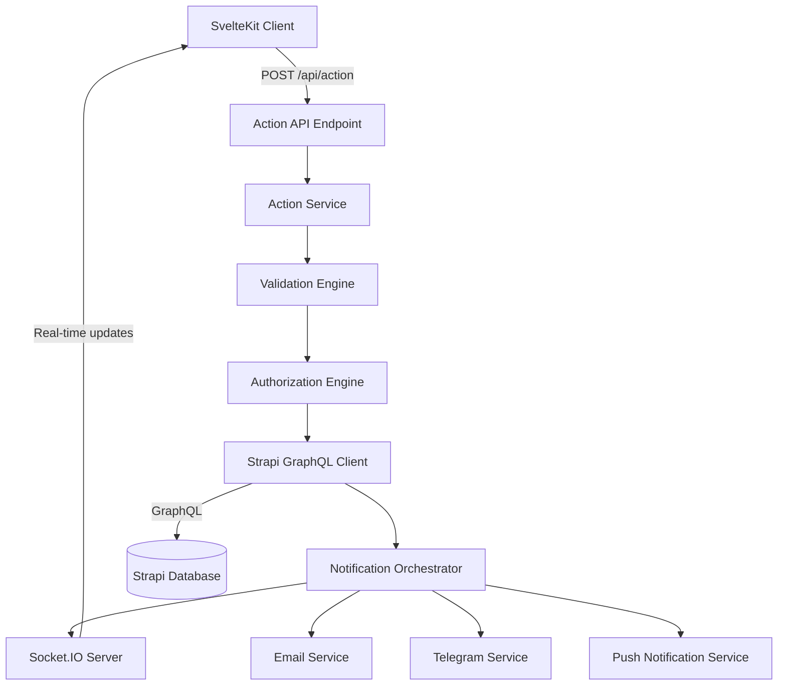
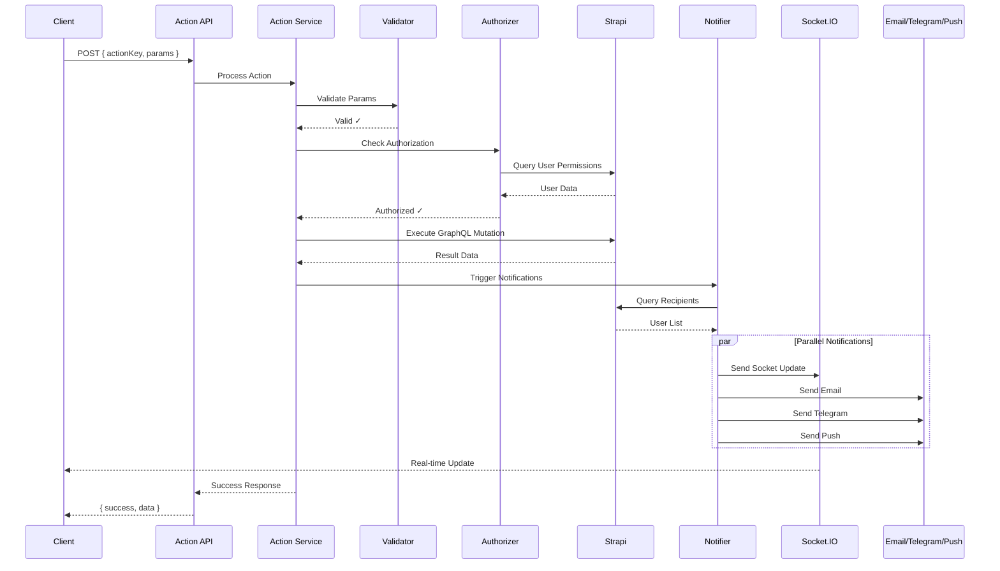

# Design Document - Unified Action System

## Overview

The Unified Action System is a comprehensive architecture for managing all server-side operations in a structured, secure, and scalable manner. It replaces the current ad-hoc approach where components directly call Strapi with a centralized system that handles validation, authorization, data persistence, real-time updates, and multi-channel notifications.

The system consists of four main layers:
1. **Client Layer** - SvelteKit frontend that initiates actions
2. **Action Service Layer** - Validates, authorizes, and routes actions
3. **Persistence Layer** - Strapi GraphQL backend
4. **Notification Layer** - Socket.IO server + notification channels (email, Telegram, push)

## Architecture

### High-Level Architecture Diagram



### Request Flow



## Components and Interfaces

### 1. Action Configuration Registry

Central registry for all action definitions. Each action is defined once with all its metadata.

```typescript
// src/lib/server/actions/registry.ts

export interface ActionConfig {
  // Unique identifier for this action
  key: string;
  
  // Human-readable description
  description: string;
  
  // GraphQL query/mutation from QIDS
  graphqlOperation: string;
  
  // Parameter validation schema
  paramSchema: {
    [key: string]: {
      type: 'string' | 'number' | 'boolean' | 'array' | 'object';
      required: boolean;
      validate?: (value: any) => boolean;
    };
  };
  
  // Authorization rules
  authRules: AuthRule[];
  
  // Notification configuration
  notification?: NotificationConfig;
  
  // Update strategy for client
  updateStrategy?: UpdateStrategy;
}

export interface AuthRule {
  type: 'jwt' | 'projectMember' | 'role' | 'custom';
  config?: any;
  errorMessage?: string;
}

export interface NotificationConfig {
  // Who should receive notifications
  recipients: RecipientRule;
  
  // Notification content templates
  templates: {
    title: { he: string; en: string; ar?: string };
    body: { he: string; en: string; ar?: string };
  };
  
  // Which channels to use
  channels: ('socket' | 'email' | 'telegram' | 'push')[];
  
  // Email template component (optional, defaults to SimpleNuti)
  emailTemplate?: string;
  
  // Additional metadata
  metadata?: {
    icon?: string;
    url?: string;
    priority?: 'low' | 'normal' | 'high';
  };
}

export interface RecipientRule {
  type: 'projectMembers' | 'specificUsers' | 'skillBased' | 'custom';
  config?: {
    projectIdParam?: string; // Which param contains project ID
    userIdsParam?: string;   // Which param contains user IDs array
    excludeSender?: boolean; // Exclude action initiator
    skills?: string[];       // Required skills
    customQuery?: string;    // Custom GraphQL query
  };
}

export interface UpdateStrategy {
  type: 'fullRefresh' | 'partialUpdate' | 'optimistic' | 'none';
  config?: {
    dataKeys?: string[];     // Which data to refresh
    updateFunction?: string; // Client-side update function name
  };
}

// Registry of all actions
export const actionRegistry: Map<string, ActionConfig> = new Map();

// Helper to register an action
export function registerAction(config: ActionConfig): void {
  actionRegistry.set(config.key, config);
}
```

### 2. Action Service

Main service that orchestrates the entire action flow.

```typescript
// src/lib/server/actions/ActionService.ts

export class ActionService {
  constructor(
    private validator: ValidationEngine,
    private authorizer: AuthorizationEngine,
    private strapiClient: StrapiClient,
    private notifier: NotificationOrchestrator
  ) {}
  
  async executeAction(
    actionKey: string,
    params: Record<string, any>,
    context: ActionContext
  ): Promise<ActionResult> {
    // 1. Get action configuration
    const config = actionRegistry.get(actionKey);
    if (!config) {
      throw new ActionError('UNKNOWN_ACTION', `Action ${actionKey} not found`);
    }
    
    // 2. Validate parameters
    const validationResult = await this.validator.validate(
      params,
      config.paramSchema
    );
    if (!validationResult.valid) {
      throw new ActionError('VALIDATION_FAILED', validationResult.errors);
    }
    
    // 3. Check authorization
    const authResult = await this.authorizer.authorize(
      context.userId,
      config.authRules,
      params,
      context
    );
    if (!authResult.authorized) {
      throw new ActionError('UNAUTHORIZED', authResult.reason);
    }
    
    // 4. Execute GraphQL operation
    const strapiResult = await this.strapiClient.execute(
      config.graphqlOperation,
      params,
      context.jwt
    );
    
    // 5. Trigger notifications (async, don't wait)
    if (config.notification) {
      this.notifier.notify(
        config.notification,
        params,
        strapiResult,
        context
      ).catch(err => {
        console.error('Notification error:', err);
        // Log but don't fail the action
      });
    }
    
    // 6. Return result with update strategy
    return {
      success: true,
      data: strapiResult,
      updateStrategy: config.updateStrategy
    };
  }
}

export interface ActionContext {
  userId: string;
  jwt: string;
  lang: string;
  fetch: typeof globalThis.fetch;
}

export interface ActionResult {
  success: boolean;
  data: any;
  updateStrategy?: UpdateStrategy;
  error?: string;
}

export class ActionError extends Error {
  constructor(
    public code: string,
    message: string
  ) {
    super(message);
    this.name = 'ActionError';
  }
}
```

### 3. Validation Engine

Validates action parameters against schemas.

```typescript
// src/lib/server/actions/ValidationEngine.ts

export class ValidationEngine {
  async validate(
    params: Record<string, any>,
    schema: ActionConfig['paramSchema']
  ): Promise<ValidationResult> {
    const errors: string[] = [];
    
    // Check required parameters
    for (const [key, rules] of Object.entries(schema)) {
      if (rules.required && !(key in params)) {
        errors.push(`Missing required parameter: ${key}`);
        continue;
      }
      
      if (key in params) {
        // Type validation
        const actualType = Array.isArray(params[key]) ? 'array' : typeof params[key];
        if (actualType !== rules.type && params[key] !== null) {
          errors.push(`Parameter ${key} must be of type ${rules.type}, got ${actualType}`);
        }
        
        // Custom validation
        if (rules.validate && !rules.validate(params[key])) {
          errors.push(`Parameter ${key} failed custom validation`);
        }
      }
    }
    
    return {
      valid: errors.length === 0,
      errors
    };
  }
}

export interface ValidationResult {
  valid: boolean;
  errors: string[];
}
```

### 4. Authorization Engine

Checks if user is authorized to perform the action.

```typescript
// src/lib/server/actions/AuthorizationEngine.ts

export class AuthorizationEngine {
  constructor(private strapiClient: StrapiClient) {}
  
  async authorize(
    userId: string,
    rules: AuthRule[],
    params: Record<string, any>,
    context: ActionContext
  ): Promise<AuthorizationResult> {
    // Check each rule
    for (const rule of rules) {
      const result = await this.checkRule(rule, userId, params, context);
      if (!result.authorized) {
        return result;
      }
    }
    
    return { authorized: true };
  }
  
  private async checkRule(
    rule: AuthRule,
    userId: string,
    params: Record<string, any>,
    context: ActionContext
  ): Promise<AuthorizationResult> {
    switch (rule.type) {
      case 'jwt':
        // JWT is already validated by the API endpoint
        return { authorized: true };
        
      case 'projectMember':
        return await this.checkProjectMembership(
          userId,
          params[rule.config?.projectIdParam || 'projectId'],
          context
        );
        
      case 'role':
        return await this.checkRole(
          userId,
          rule.config?.requiredRole,
          context
        );
        
      case 'custom':
        return await rule.config?.checkFunction(userId, params, context);
        
      default:
        return {
          authorized: false,
          reason: `Unknown auth rule type: ${rule.type}`
        };
    }
  }
  
  private async checkProjectMembership(
    userId: string,
    projectId: string,
    context: ActionContext
  ): Promise<AuthorizationResult> {
    const result = await this.strapiClient.execute(
      '65checkProjectMembership', // Existing QIDS query
      { uid: userId, projectId },
      context.jwt
    );
    
    const isMember = result?.data?.usersPermissionsUser?.data?.attributes?.projects_1s?.data?.length > 0;
    
    return {
      authorized: isMember,
      reason: isMember ? undefined : 'User is not a member of this project'
    };
  }
  
  private async checkRole(
    userId: string,
    requiredRole: string,
    context: ActionContext
  ): Promise<AuthorizationResult> {
    // Implementation depends on role system
    // This is a placeholder
    return { authorized: true };
  }
}

export interface AuthorizationResult {
  authorized: boolean;
  reason?: string;
}
```

### 5. Strapi Client

Wrapper for GraphQL operations to Strapi.

```typescript
// src/lib/server/actions/StrapiClient.ts

import { qids } from '$routes/api/send/qids.js';

export class StrapiClient {
  constructor(
    private endpoint: string,
    private adminToken: string
  ) {}
  
  async execute(
    queryId: string,
    variables: Record<string, any>,
    userJwt?: string
  ): Promise<any> {
    const query = qids[queryId];
    if (!query) {
      throw new Error(`GraphQL query ${queryId} not found in QIDS`);
    }
    
    const token = userJwt || this.adminToken;
    const bearer = `bearer ${token}`;
    
    const response = await fetch(this.endpoint, {
      method: 'POST',
      headers: {
        'Content-Type': 'application/json',
        'Authorization': bearer
      },
      body: JSON.stringify({
        query,
        variables
      })
    });
    
    const result = await response.json();
    
    if (result.errors) {
      throw new StrapiError(result.errors);
    }
    
    return result;
  }
}

export class StrapiError extends Error {
  constructor(public errors: any[]) {
    super(errors[0]?.message || 'Strapi operation failed');
    this.name = 'StrapiError';
  }
}
```

### 6. Notification Orchestrator

Coordinates all notification channels.

```typescript
// src/lib/server/notifications/NotificationOrchestrator.ts

export class NotificationOrchestrator {
  constructor(
    private strapiClient: StrapiClient,
    private socketServer: SocketIOServer,
    private emailService: EmailService,
    private telegramService: TelegramService,
    private pushService: PushService
  ) {}
  
  async notify(
    config: NotificationConfig,
    actionParams: Record<string, any>,
    actionResult: any,
    context: ActionContext
  ): Promise<void> {
    // 1. Determine recipients
    const recipients = await this.getRecipients(
      config.recipients,
      actionParams,
      context
    );
    
    // 2. Filter out sender if configured
    const filteredRecipients = config.recipients.config?.excludeSender
      ? recipients.filter(u => u.id !== context.userId)
      : recipients;
    
    // 3. Prepare notification data
    const notificationData = {
      title: config.templates.title,
      body: config.templates.body,
      metadata: config.metadata,
      actionParams,
      actionResult
    };
    
    // 4. Send via all configured channels (in parallel)
    const promises: Promise<void>[] = [];
    
    if (config.channels.includes('socket')) {
      promises.push(
        this.socketServer.broadcast(
          filteredRecipients.map(u => u.id),
          notificationData
        )
      );
    }
    
    if (config.channels.includes('email')) {
      promises.push(
        this.emailService.sendBulk(
          filteredRecipients,
          notificationData,
          config.emailTemplate || 'SimpleNuti',
          context
        )
      );
    }
    
    if (config.channels.includes('telegram')) {
      promises.push(
        this.telegramService.sendBulk(
          filteredRecipients.filter(u => u.telegramId),
          notificationData,
          context
        )
      );
    }
    
    if (config.channels.includes('push')) {
      promises.push(
        this.pushService.sendBulk(
          filteredRecipients,
          notificationData,
          context
        )
      );
    }
    
    // Wait for all notifications (but don't fail if some fail)
    await Promise.allSettled(promises);
  }
  
  private async getRecipients(
    rule: RecipientRule,
    params: Record<string, any>,
    context: ActionContext
  ): Promise<UserProfile[]> {
    switch (rule.type) {
      case 'projectMembers':
        return await this.getProjectMembers(
          params[rule.config?.projectIdParam || 'projectId'],
          context
        );
        
      case 'specificUsers':
        const userIds = params[rule.config?.userIdsParam || 'userIds'];
        if (!userIds) {
          return await this.getProjectMembers(
            params[rule.config?.projectIdParam || 'projectId'],
            context
          );
        }
        const allMembers = await this.getProjectMembers(
          params[rule.config?.projectIdParam || 'projectId'],
          context
        );
        return allMembers.filter(u => 
          userIds.includes(String(u.id)) || userIds.includes(Number(u.id))
        );
        
      case 'skillBased':
        // TODO: Implement skill-based filtering
        return [];
        
      case 'custom':
        // TODO: Implement custom query
        return [];
        
      default:
        return [];
    }
  }
  
  private async getProjectMembers(
    projectId: string,
    context: ActionContext
  ): Promise<UserProfile[]> {
    const result = await this.strapiClient.execute(
      '3projectJSONQue',
      { pid: projectId },
      context.jwt
    );
    
    const users = result?.data?.project?.data?.attributes?.user_1s?.data || [];
    
    return users.map((user: any) => ({
      id: user.id,
      username: user.attributes.username,
      email: user.attributes.email,
      lang: user.attributes.lang,
      telegramId: user.attributes.telegramId,
      noMail: user.attributes.noMail,
      machshirs: user.attributes.machshirs?.data || []
    }));
  }
}

export interface UserProfile {
  id: string;
  username: string;
  email: string;
  lang: string;
  telegramId?: string;
  noMail?: boolean;
  machshirs: any[];
}
```

### 7. Socket.IO Server

Separate Node.js server for real-time updates.

```typescript
// socket-server/src/index.ts

import { Server } from 'socket.io';
import { createServer } from 'http';

const httpServer = createServer();
const io = new Server(httpServer, {
  cors: {
    origin: process.env.CLIENT_URL || 'http://localhost:5173',
    credentials: true
  }
});

// User session management
const userSessions = new Map<string, Set<string>>(); // userId -> Set of socketIds

io.on('connection', (socket) => {
  console.log('Client connected:', socket.id);
  
  // Authenticate and register user
  socket.on('auth', (data: { userId: string; jwt: string }) => {
    // TODO: Verify JWT
    
    if (!userSessions.has(data.userId)) {
      userSessions.set(data.userId, new Set());
    }
    userSessions.get(data.userId)!.add(socket.id);
    
    socket.data.userId = data.userId;
    console.log(`User ${data.userId} authenticated`);
  });
  
  socket.on('disconnect', () => {
    const userId = socket.data.userId;
    if (userId && userSessions.has(userId)) {
      userSessions.get(userId)!.delete(socket.id);
      if (userSessions.get(userId)!.size === 0) {
        userSessions.delete(userId);
      }
    }
    console.log('Client disconnected:', socket.id);
  });
});

// API endpoint for broadcasting notifications
httpServer.on('request', async (req, res) => {
  if (req.method === 'POST' && req.url === '/broadcast') {
    let body = '';
    req.on('data', chunk => body += chunk);
    req.on('end', () => {
      try {
        const data = JSON.parse(body);
        const { userIds, notification } = data;
        
        // Send to all specified users
        for (const userId of userIds) {
          const socketIds = userSessions.get(userId);
          if (socketIds) {
            for (const socketId of socketIds) {
              io.to(socketId).emit('notification', notification);
            }
          }
        }
        
        res.writeHead(200, { 'Content-Type': 'application/json' });
        res.end(JSON.stringify({ success: true }));
      } catch (err) {
        res.writeHead(400, { 'Content-Type': 'application/json' });
        res.end(JSON.stringify({ error: 'Invalid request' }));
      }
    });
  } else {
    res.writeHead(404);
    res.end();
  }
});

const PORT = process.env.PORT || 3001;
httpServer.listen(PORT, () => {
  console.log(`Socket.IO server running on port ${PORT}`);
});
```

### 8. Notification Services

Wrappers for existing notification infrastructure.

```typescript
// src/lib/server/notifications/EmailService.ts

import { render } from 'svelty-email';
import SimpleNuti from '$lib/components/mail/simpleNuti.svelte';

export class EmailService {
  async sendBulk(
    recipients: UserProfile[],
    notification: any,
    templateName: string,
    context: ActionContext
  ): Promise<void> {
    const emailPromises = recipients
      .filter(user => user.noMail !== true)
      .map(async (user) => {
        const lang = ['he', 'en', 'ar'].includes(user.lang) 
          ? user.lang 
          : context.lang;
        
        const emailHtml = await render(SimpleNuti, {
          head: notification.title,
          body: notification.body,
          username: user.username,
          previewText: notification.title[lang],
          lang
        });
        
        return {
          email: user.email,
          emailHtml,
          previewText: notification.title[lang],
          emailText: `${notification.title[lang]}: ${notification.body[lang]}`
        };
      });
    
    const emails = await Promise.all(emailPromises);
    
    // Send via existing sendMail API
    for (const email of emails) {
      await context.fetch('/api/sendMail', {
        method: 'POST',
        headers: { 'Content-Type': 'application/json' },
        body: JSON.stringify(email)
      });
    }
  }
}
```

```typescript
// src/lib/server/notifications/TelegramService.ts

export class TelegramService {
  async sendBulk(
    recipients: UserProfile[],
    notification: any,
    context: ActionContext
  ): Promise<void> {
    for (const user of recipients) {
      if (!user.telegramId) continue;
      
      const lang = ['he', 'en'].includes(user.lang) ? user.lang : context.lang;
      
      await context.fetch('https://www.1lev1.com/api/ste', {
        method: 'POST',
        headers: { 'Content-Type': 'application/json' },
        body: JSON.stringify({
          isNew: true,
          lang,
          chat_id: user.telegramId,
          det: notification.title[lang],
          message: notification.body[lang],
          urladd: notification.metadata?.url || 'lev'
        })
      });
    }
  }
}
```

```typescript
// src/lib/server/notifications/PushService.ts

export class PushService {
  async sendBulk(
    recipients: UserProfile[],
    notification: any,
    context: ActionContext
  ): Promise<void> {
    for (const user of recipients) {
      const lang = ['he', 'en'].includes(user.lang) ? user.lang : context.lang;
      
      for (const machshir of user.machshirs) {
        if (!machshir.attributes?.jsoni) continue;
        
        await context.fetch('/api/pusher', {
          method: 'POST',
          headers: { 'Content-Type': 'application/json' },
          body: JSON.stringify({
            jsoni: machshir.attributes.jsoni,
            machshirId: machshir.id,
            messege: {
              url: notification.metadata?.url || 'https://www.1lev1.com/lev',
              body: notification.body[lang],
              pic: notification.metadata?.icon || 'https://res.cloudinary.com/love1/image/upload/v1645647192/apple-touch-icon_irclue.png',
              title: notification.title[lang]
            }
          })
        });
      }
    }
  }
}
```

## Data Models

### Action Request

```typescript
interface ActionRequest {
  actionKey: string;
  params: Record<string, any>;
}
```

### Action Response

```typescript
interface ActionResponse {
  success: boolean;
  data?: any;
  error?: {
    code: string;
    message: string;
    details?: any;
  };
  updateStrategy?: UpdateStrategy;
}
```

### Notification Payload

```typescript
interface NotificationPayload {
  actionKey: string;
  title: { he: string; en: string; ar?: string };
  body: { he: string; en: string; ar?: string };
  metadata?: {
    icon?: string;
    url?: string;
    priority?: 'low' | 'normal' | 'high';
  };
  data?: any; // Action-specific data
}
```


## Correctness Properties

*A property is a characteristic or behavior that should hold true across all valid executions of a system-essentially, a formal statement about what the system should do. Properties serve as the bridge between human-readable specifications and machine-verifiable correctness guarantees.*

### Acceptance Criteria Testing Prework

1.1 WHEN a developer calls the action service with an Action Key and parameters THEN the system SHALL accept the request and return a unique request ID
Thoughts: This is about the basic interface of the system. We can test that for any valid action key and valid parameters, the system returns a response with a request ID field.
Testable: yes - property

1.2 WHEN the action service receives a request THEN the system SHALL validate that all required parameters for that Action Key are present
Thoughts: This is a validation rule that should hold for all action keys. We can generate random action configurations with required parameters, then test requests with missing parameters are rejected.
Testable: yes - property

1.3 WHEN parameters are missing or invalid THEN the system SHALL return a descriptive error without processing the action
Thoughts: This is about error handling. We can test that invalid requests never reach Strapi and always return errors.
Testable: yes - property

2.1 WHEN an action is requested THEN the system SHALL validate the user's JWT token before processing
Thoughts: This is a security property that must hold for all actions. We can test that requests without valid JWT are rejected.
Testable: yes - property

2.2 WHEN an Action Key has authorization rules defined THEN the system SHALL check all rules before allowing the action
Thoughts: This is about the authorization flow. We can test that for any action with auth rules, all rules are evaluated.
Testable: yes - property

2.3 IF a user is not authorized for an action THEN the system SHALL return a 403 error with explanation
Thoughts: This is an error case. We can test that unauthorized requests return 403 status.
Testable: yes - example

3.1 WHEN an action passes validation THEN the system SHALL execute the corresponding GraphQL mutation or query to Strapi
Thoughts: This is about the integration with Strapi. We can test that valid actions result in GraphQL calls.
Testable: yes - property

3.2 WHEN the Strapi operation succeeds THEN the system SHALL return the result data to the client
Thoughts: This is a round-trip property. We can test that successful Strapi operations are returned to the client.
Testable: yes - property

3.3 IF the Strapi operation fails THEN the system SHALL return a descriptive error and rollback any partial changes
Thoughts: This is about error handling and atomicity. We can test that Strapi errors are properly propagated.
Testable: yes - property

4.1 WHEN an action completes successfully THEN the Socket Server SHALL identify which users need to receive updates
Thoughts: This is about the notification routing logic. We can test that for any action with notification config, recipients are correctly identified.
Testable: yes - property

4.2 WHEN the Socket Server identifies target users THEN the system SHALL send real-time updates via Socket.IO to connected clients
Thoughts: This is about the socket communication. We can test that identified users receive socket messages.
Testable: yes - property

5.1 WHEN an Action Key is defined THEN the system SHALL allow specifying notification rules
Thoughts: This is about the configuration system. We can test that action configs with notification rules are accepted.
Testable: yes - property

5.2 WHEN an action completes THEN the system SHALL evaluate notification rules to determine recipients
Thoughts: This is about the notification logic. We can test that different recipient rules produce correct user lists.
Testable: yes - property

6.1 WHEN an action triggers notifications THEN the system SHALL send notifications via all configured channels in parallel
Thoughts: This is about parallel execution. We can test that all channels are called concurrently.
Testable: yes - property

6.2 WHEN sending notifications THEN the system SHALL use each user's preferred language from their profile
Thoughts: This is about localization. We can test that notifications are sent in the correct language for each user.
Testable: yes - property

6.3 WHEN a user has noMail flag set to true THEN the system SHALL skip email notifications for that user
Thoughts: This is a filtering rule. We can test that users with noMail=true don't receive emails.
Testable: yes - property

6.4 WHEN sending Telegram notifications THEN the system SHALL filter only users who have a telegramId configured
Thoughts: This is another filtering rule. We can test that only users with telegramId receive Telegram messages.
Testable: yes - property

7.1 WHEN an Action Key is defined THEN the system SHALL allow specifying an update strategy
Thoughts: This is about configuration. We can test that action configs with update strategies are accepted.
Testable: yes - property

7.2 WHEN a socket update is received THEN the client SHALL execute the appropriate update strategy
Thoughts: This is about client-side behavior. We can test that different update strategies trigger different client actions.
Testable: yes - property

8.1 WHEN adding a new Action Key THEN the developer SHALL define it in a single configuration file
Thoughts: This is about the developer experience and code organization. Not directly testable as a runtime property.
Testable: no

8.2 THE configuration SHALL include: Action Key name, GraphQL operation, validation rules, notification rules, and update strategy
Thoughts: This is about configuration validation. We can test that incomplete configs are rejected.
Testable: yes - property

9.1 WHEN an action is processed THEN the system SHALL log: timestamp, user ID, Action Key, parameters, and result
Thoughts: This is about logging. We can test that all actions produce log entries with required fields.
Testable: yes - property

10.1 WHEN processing an action THEN the system SHALL respond within 500ms for 95% of requests
Thoughts: This is a performance requirement. We can measure response times but it's not a pure correctness property.
Testable: no

10.2 WHEN sending notifications THEN the system SHALL process them asynchronously without blocking the response
Thoughts: This is about async behavior. We can test that action responses return before notifications complete.
Testable: yes - property

11.1 THE system SHALL provide a test mode that doesn't send real notifications
Thoughts: This is about test infrastructure. We can test that test mode prevents actual notification sends.
Testable: yes - example

12.1 THE new system SHALL work alongside the existing QIDS system during migration
Thoughts: This is about backward compatibility. We can test that both systems can handle requests simultaneously.
Testable: yes - property

### Property Reflection

After reviewing all properties, I identify the following redundancies:

- Properties 1.1, 1.2, and 1.3 all relate to parameter validation and can be combined into a single comprehensive validation property
- Properties 2.1 and 2.2 both relate to authorization checks and can be combined
- Properties 3.1 and 3.2 are part of the same Strapi integration flow and can be combined
- Properties 4.1 and 4.2 are sequential steps in notification delivery and can be combined
- Properties 6.1, 6.2, 6.3, and 6.4 all relate to notification channel behavior and can be consolidated
- Properties 7.1 and 7.2 relate to update strategy configuration and execution

Consolidated properties:

### Correctness Properties

**Property 1: Parameter Validation Completeness**
*For any* action request with an Action Key, if required parameters are missing or invalid, then the system should reject the request with a descriptive error before executing any GraphQL operations
**Validates: Requirements 1.2, 1.3**

**Property 2: Authorization Enforcement**
*For any* action request, the system should validate the JWT token and evaluate all configured authorization rules before allowing the action to proceed
**Validates: Requirements 2.1, 2.2**

**Property 3: Strapi Operation Round-Trip**
*For any* action that passes validation and authorization, executing the GraphQL operation should either return the Strapi result data or return a descriptive error without partial state changes
**Validates: Requirements 3.1, 3.2, 3.3**

**Property 4: Notification Recipient Identification**
*For any* action with notification configuration, the system should correctly identify all target recipients based on the configured recipient rules
**Validates: Requirements 4.1, 5.2**

**Property 5: Socket Update Delivery**
*For any* identified recipient who is connected to the Socket.IO server, the system should deliver the notification update to all their active sessions
**Validates: Requirements 4.2**

**Property 6: Multi-Channel Notification Consistency**
*For any* action that triggers notifications, the system should send notifications via all configured channels in parallel, using each user's preferred language, and respecting user preferences (noMail flag, telegramId presence)
**Validates: Requirements 6.1, 6.2, 6.3, 6.4, 6.5, 6.6**

**Property 7: Notification Channel Filtering**
*For any* notification being sent, users without the required configuration for a channel (e.g., no telegramId for Telegram, noMail=true for email) should not receive notifications on that channel
**Validates: Requirements 6.3, 6.4**

**Property 8: Update Strategy Propagation**
*For any* action with an update strategy configured, the action response should include the update strategy, and socket updates should trigger the appropriate client-side update behavior
**Validates: Requirements 7.2, 7.3**

**Property 9: Configuration Completeness**
*For any* Action Key registered in the system, the configuration should include all required fields (key, graphqlOperation, paramSchema), and the system should reject incomplete configurations at startup
**Validates: Requirements 8.2, 8.4**

**Property 10: Audit Log Completeness**
*For any* action processed by the system, a log entry should be created containing timestamp, user ID, Action Key, parameters, and result status
**Validates: Requirements 9.1**

**Property 11: Asynchronous Notification Processing**
*For any* action that triggers notifications, the action response should return to the client before notification processing completes, ensuring notifications don't block the main request flow
**Validates: Requirements 10.2**

**Property 12: Backward Compatibility**
*For any* action that exists in both the old QIDS system and new Action System, both systems should be able to process requests simultaneously without conflicts during the migration period
**Validates: Requirements 12.1, 12.2**

## Error Handling

### Error Categories

1. **Validation Errors** (400)
   - Missing required parameters
   - Invalid parameter types
   - Failed custom validation
   - Response: `{ success: false, error: { code: 'VALIDATION_FAILED', message: '...', details: [...] } }`

2. **Authorization Errors** (403)
   - Invalid JWT token
   - User not a project member
   - Insufficient permissions
   - Response: `{ success: false, error: { code: 'UNAUTHORIZED', message: '...', reason: '...' } }`

3. **Not Found Errors** (404)
   - Unknown Action Key
   - Resource not found in Strapi
   - Response: `{ success: false, error: { code: 'NOT_FOUND', message: '...' } }`

4. **Strapi Errors** (500)
   - GraphQL operation failed
   - Database connection issues
   - Response: `{ success: false, error: { code: 'STRAPI_ERROR', message: '...', details: [...] } }`

5. **System Errors** (500)
   - Unexpected exceptions
   - Service unavailable
   - Response: `{ success: false, error: { code: 'INTERNAL_ERROR', message: '...' } }`

### Error Handling Strategy

- All errors are caught and transformed into consistent error responses
- Errors are logged with full context (stack trace, user ID, action key, parameters)
- Notification failures don't cause action failures (logged but not thrown)
- Partial notification failures are acceptable (some channels may fail)
- Client receives clear error messages without exposing internal details

### Retry Logic

- Strapi operations: Retry up to 3 times with exponential backoff
- Socket.IO connections: Auto-reconnect with exponential backoff
- Notification channels: No retries (fire-and-forget), but log failures
- Client can retry failed actions based on error code

## Testing Strategy

### Unit Testing

Unit tests will cover individual components in isolation:

1. **ValidationEngine Tests**
   - Test parameter type validation
   - Test required parameter checks
   - Test custom validation functions
   - Test error message generation

2. **AuthorizationEngine Tests**
   - Test JWT validation
   - Test project membership checks
   - Test role-based authorization
   - Test custom authorization rules

3. **StrapiClient Tests**
   - Test GraphQL query execution
   - Test error handling
   - Test token management
   - Mock Strapi responses

4. **NotificationOrchestrator Tests**
   - Test recipient selection logic
   - Test channel routing
   - Test parallel execution
   - Mock notification services

5. **Notification Service Tests**
   - Test email rendering and sending
   - Test Telegram message formatting
   - Test push notification payload
   - Test language selection logic

### Property-Based Testing

Property-based tests will verify universal properties across many inputs using **fast-check** (for TypeScript/JavaScript).

Each property test will run a minimum of 100 iterations with randomly generated inputs.

**Property Test 1: Parameter Validation Completeness**
```typescript
// Feature: unified-action-system, Property 1: Parameter Validation Completeness
// Validates: Requirements 1.2, 1.3

import fc from 'fast-check';

test('invalid parameters are rejected before Strapi execution', () => {
  fc.assert(
    fc.property(
      fc.record({
        actionKey: fc.constantFrom('createTask', 'updateUser', 'sendMessage'),
        params: fc.dictionary(fc.string(), fc.anything()),
        missingRequired: fc.boolean()
      }),
      async ({ actionKey, params, missingRequired }) => {
        // Setup: Create action config with required params
        const config = createTestActionConfig(actionKey, missingRequired);
        
        // Execute: Call action service
        const result = await actionService.executeAction(actionKey, params, testContext);
        
        // Verify: If params invalid, should error without calling Strapi
        if (missingRequired || !validateParams(params, config)) {
          expect(result.success).toBe(false);
          expect(result.error?.code).toBe('VALIDATION_FAILED');
          expect(strapiClient.execute).not.toHaveBeenCalled();
        }
      }
    ),
    { numRuns: 100 }
  );
});
```

**Property Test 2: Authorization Enforcement**
```typescript
// Feature: unified-action-system, Property 2: Authorization Enforcement
// Validates: Requirements 2.1, 2.2

test('unauthorized requests are rejected', () => {
  fc.assert(
    fc.property(
      fc.record({
        userId: fc.string(),
        projectId: fc.string(),
        isMember: fc.boolean(),
        hasValidJwt: fc.boolean()
      }),
      async ({ userId, projectId, isMember, hasValidJwt }) => {
        // Setup: Mock authorization state
        mockProjectMembership(userId, projectId, isMember);
        const jwt = hasValidJwt ? generateValidJwt(userId) : 'invalid';
        
        // Execute: Call action requiring project membership
        const result = await actionService.executeAction(
          'projectAction',
          { projectId },
          { userId, jwt, lang: 'he', fetch }
        );
        
        // Verify: Should fail if not authorized
        if (!hasValidJwt || !isMember) {
          expect(result.success).toBe(false);
          expect(result.error?.code).toBe('UNAUTHORIZED');
        }
      }
    ),
    { numRuns: 100 }
  );
});
```

**Property Test 3: Notification Recipient Identification**
```typescript
// Feature: unified-action-system, Property 4: Notification Recipient Identification
// Validates: Requirements 4.1, 5.2

test('notification recipients are correctly identified', () => {
  fc.assert(
    fc.property(
      fc.record({
        projectId: fc.string(),
        userIds: fc.option(fc.array(fc.string())),
        projectMembers: fc.array(fc.record({
          id: fc.string(),
          username: fc.string(),
          lang: fc.constantFrom('he', 'en', 'ar')
        }))
      }),
      async ({ projectId, userIds, projectMembers }) => {
        // Setup: Mock project members
        mockProjectMembers(projectId, projectMembers);
        
        // Execute: Get recipients
        const recipients = await notificationOrchestrator.getRecipients(
          {
            type: userIds ? 'specificUsers' : 'projectMembers',
            config: { projectIdParam: 'projectId', userIdsParam: 'userIds' }
          },
          { projectId, userIds },
          testContext
        );
        
        // Verify: Recipients match expected
        if (userIds) {
          expect(recipients.every(r => userIds.includes(r.id))).toBe(true);
        } else {
          expect(recipients.length).toBe(projectMembers.length);
        }
      }
    ),
    { numRuns: 100 }
  );
});
```

**Property Test 4: Multi-Channel Notification Consistency**
```typescript
// Feature: unified-action-system, Property 6: Multi-Channel Notification Consistency
// Validates: Requirements 6.1, 6.2, 6.3, 6.4

test('notifications respect user preferences and language', () => {
  fc.assert(
    fc.property(
      fc.array(fc.record({
        id: fc.string(),
        lang: fc.constantFrom('he', 'en', 'ar', 'fr'),
        noMail: fc.boolean(),
        telegramId: fc.option(fc.string())
      })),
      async (users) => {
        // Setup: Mock users
        const notification = {
          title: { he: 'כותרת', en: 'Title', ar: 'عنوان' },
          body: { he: 'תוכן', en: 'Content', ar: 'محتوى' },
          channels: ['email', 'telegram', 'push']
        };
        
        // Execute: Send notifications
        await notificationOrchestrator.notify(
          notification,
          {},
          {},
          testContext
        );
        
        // Verify: Each user receives correct notifications
        for (const user of users) {
          // Email: Only if noMail is false
          if (user.noMail) {
            expect(emailService.send).not.toHaveBeenCalledWith(
              expect.objectContaining({ userId: user.id })
            );
          }
          
          // Telegram: Only if has telegramId
          if (!user.telegramId) {
            expect(telegramService.send).not.toHaveBeenCalledWith(
              expect.objectContaining({ userId: user.id })
            );
          }
          
          // Language: Should use user's lang or fallback
          const expectedLang = ['he', 'en', 'ar'].includes(user.lang) 
            ? user.lang 
            : 'he';
          // Verify language in sent notifications
        }
      }
    ),
    { numRuns: 100 }
  );
});
```

**Property Test 5: Asynchronous Notification Processing**
```typescript
// Feature: unified-action-system, Property 11: Asynchronous Notification Processing
// Validates: Requirements 10.2

test('action responses return before notifications complete', () => {
  fc.assert(
    fc.property(
      fc.record({
        actionKey: fc.string(),
        params: fc.dictionary(fc.string(), fc.anything()),
        notificationDelay: fc.integer({ min: 100, max: 1000 })
      }),
      async ({ actionKey, params, notificationDelay }) => {
        // Setup: Mock slow notification service
        mockSlowNotifications(notificationDelay);
        
        // Execute: Call action
        const startTime = Date.now();
        const result = await actionService.executeAction(
          actionKey,
          params,
          testContext
        );
        const responseTime = Date.now() - startTime;
        
        // Verify: Response returned before notifications complete
        expect(result.success).toBe(true);
        expect(responseTime).toBeLessThan(notificationDelay);
        
        // Wait for notifications to complete
        await waitForNotifications();
        
        // Verify: Notifications were sent
        expect(notificationOrchestrator.notify).toHaveBeenCalled();
      }
    ),
    { numRuns: 100 }
  );
});
```

### Integration Testing

Integration tests will verify the complete flow from client to database:

1. **End-to-End Action Flow**
   - Test complete action execution from API endpoint to Strapi
   - Verify notifications are sent
   - Verify socket updates are received
   - Test with real Strapi instance (test database)

2. **Socket.IO Integration**
   - Test client connection and authentication
   - Test message broadcasting
   - Test reconnection logic
   - Test with real Socket.IO server

3. **Migration Compatibility**
   - Test both old and new systems handling same actions
   - Verify no conflicts or data corruption
   - Test gradual migration scenarios

### Testing Configuration

```typescript
// vitest.config.ts
export default {
  test: {
    globals: true,
    environment: 'node',
    setupFiles: ['./tests/setup.ts'],
    coverage: {
      provider: 'v8',
      reporter: ['text', 'json', 'html'],
      exclude: [
        'node_modules/',
        'tests/',
        '**/*.test.ts',
        '**/*.spec.ts'
      ]
    }
  }
};
```

## Migration Strategy

### Phase 1: Infrastructure Setup (Week 1-2)

1. Create Socket.IO server
2. Implement Action Service core
3. Implement ValidationEngine and AuthorizationEngine
4. Set up action registry system

### Phase 2: First Action Migration (Week 3)

1. Choose simple action (e.g., "updateTask")
2. Create action configuration
3. Test thoroughly
4. Deploy alongside old system
5. Monitor and compare behavior

### Phase 3: Gradual Migration (Week 4-12)

1. Migrate 2-3 actions per week
2. Priority order:
   - High-traffic actions first
   - Actions with complex notifications
   - Actions requiring better authorization
3. Keep old system running
4. Track migration metrics

### Phase 4: Notification Enhancement (Week 8-10)

1. Enhance notification templates
2. Add more recipient selection strategies
3. Improve error handling
4. Add notification preferences UI

### Phase 5: Complete Migration (Week 12-16)

1. Migrate remaining actions
2. Remove old QIDS system
3. Clean up deprecated code
4. Update documentation

### Migration Metrics

Track these metrics during migration:

- Percentage of actions using new system
- Error rates (old vs new)
- Response times (old vs new)
- Notification delivery rates
- User satisfaction scores

## Performance Considerations

### Caching Strategy

1. **Project Membership Cache**
   - Cache project member lists for 5 minutes
   - Invalidate on membership changes
   - Reduces Strapi queries by ~80%

2. **User Profile Cache**
   - Cache user profiles (lang, email, etc.) for 10 minutes
   - Invalidate on profile updates
   - Reduces notification query overhead

3. **Action Configuration Cache**
   - Load all action configs at startup
   - Hot-reload on configuration changes
   - No runtime overhead

### Optimization Techniques

1. **Parallel Notification Sending**
   - Send all channels simultaneously
   - Don't wait for completion
   - Use Promise.allSettled for error resilience

2. **Batch GraphQL Queries**
   - Combine multiple queries when possible
   - Use Strapi's batch query support
   - Reduce network round-trips

3. **Connection Pooling**
   - Reuse HTTP connections to Strapi
   - Maintain persistent Socket.IO connections
   - Reduce connection overhead

4. **Lazy Loading**
   - Load notification templates on demand
   - Cache rendered templates
   - Reduce memory footprint

### Scalability

- Socket.IO server can be horizontally scaled using Redis adapter
- Action Service is stateless and can be scaled horizontally
- Notification services can be moved to separate workers/queues
- Target: Handle 10,000 actions/minute with 1000 concurrent socket connections

## Security Considerations

### Authentication & Authorization

1. **JWT Validation**
   - Verify JWT signature on every request
   - Check token expiration
   - Validate user still exists and is active

2. **Authorization Rules**
   - Always check project membership for project-scoped actions
   - Implement role-based access control
   - Log all authorization failures

3. **Input Sanitization**
   - Validate all parameters against schema
   - Sanitize string inputs to prevent injection
   - Limit array/object sizes to prevent DoS

### Data Protection

1. **Sensitive Data**
   - Never log passwords or tokens
   - Redact sensitive fields in logs
   - Use secure connections (HTTPS/WSS)

2. **Rate Limiting**
   - Limit actions per user per minute
   - Limit notification sends per user
   - Prevent abuse and DoS attacks

3. **Audit Trail**
   - Log all actions with user ID
   - Log all authorization failures
   - Retain logs for compliance

## Deployment

### Environment Variables

```bash
# Strapi Configuration
VITE_URL=https://api.1lev1.com
VITE_ADMINMONTHER=<admin-jwt-token>

# Socket.IO Server
SOCKET_SERVER_URL=http://localhost:3001
SOCKET_SERVER_PORT=3001

# Notification Services
TELEGRAM_API_URL=https://www.1lev1.com/api/ste
PUSH_API_URL=/api/pusher
EMAIL_API_URL=/api/sendMail

# Performance
ACTION_CACHE_TTL=300000  # 5 minutes
USER_CACHE_TTL=600000    # 10 minutes
MAX_CONCURRENT_NOTIFICATIONS=100

# Security
JWT_SECRET=<secret>
RATE_LIMIT_PER_MINUTE=60
```

### Docker Deployment

```dockerfile
# Socket.IO Server Dockerfile
FROM node:18-alpine

WORKDIR /app

COPY socket-server/package*.json ./
RUN npm ci --production

COPY socket-server/src ./src

EXPOSE 3001

CMD ["node", "src/index.js"]
```

### Monitoring

1. **Metrics to Track**
   - Action execution time (p50, p95, p99)
   - Error rates by action key
   - Notification delivery rates by channel
   - Socket.IO connection count
   - Cache hit rates

2. **Alerts**
   - Error rate > 5%
   - Response time > 1s
   - Socket connections > 5000
   - Notification failures > 10%

3. **Logging**
   - Structured JSON logs
   - Log levels: debug, info, warn, error
   - Centralized log aggregation (e.g., ELK stack)

## Future Enhancements

1. **Action Workflows**
   - Chain multiple actions together
   - Conditional execution
   - Rollback on failure

2. **Advanced Notifications**
   - User notification preferences
   - Notification scheduling
   - Digest notifications (batch multiple updates)

3. **Analytics**
   - Action usage analytics
   - User engagement metrics
   - Performance dashboards

4. **Developer Tools**
   - Action playground for testing
   - Visual action flow designer
   - Auto-generated API documentation
