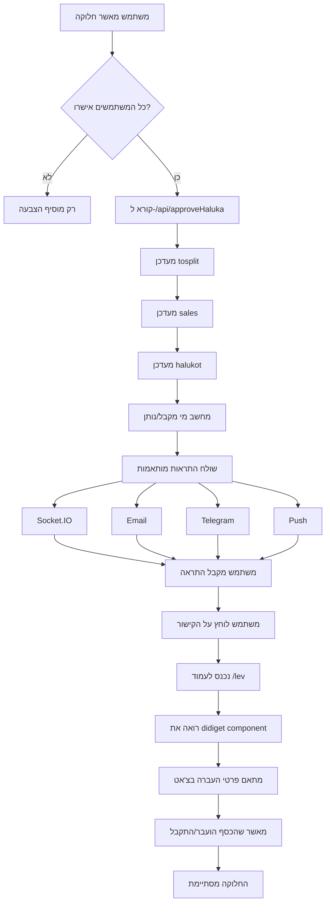

# Haluka Approval System - Implementation Summary

## מה בנינו?

מערכת מלאה לאישור חלוקות (haluka) עם התראות מותאמות אישית לכל משתמש.

## הקבצים שנוצרו

### 1. GraphQL Queries (QIDS)
**קובץ**: `src/routes/api/send/qids.js`

נוספו 3 queries חדשים:
- `79approveTosplit` - מעדכן tosplit עם הצבעות ומסמן כ-finished
- `80updateSale` - מסמן sale כ-splited
- `81updateHaluka` - מסמן haluka כ-ushar (מאושר)

### 2. API Endpoint
**קובץ**: `src/routes/api/approveHaluka/+server.ts`

Endpoint מרכזי שמטפל בכל הלוגיקה:
1. מעדכן את ה-tosplit
2. מעדכן את כל ה-sales
3. מעדכן את כל ה-halukot
4. שולח התראות מותאמות אישית

### 3. Notification Service
**קובץ**: `src/lib/server/notifications/HalukaNotificationService.ts`

שירות שמטפל בהתראות:
- מחשב מי מקבל כסף ומי נותן
- יוצר תוכן מותאם אישית לכל משתמש
- שולח התראות בכל הערוצים (Socket, Email, Telegram, Push)

### 4. Email Template
**קובץ**: `src/lib/components/mail/HalukaApproved.svelte`

תבנית מייל יפה עם:
- **למקבלים**: עיצוב חגיגי עם קונפטי 🎉
- **לנותנים**: עיצוב רשמי ומכובד 📋
- תמיכה ב-3 שפות (עברית, אנגלית, ערבית)
- כתוב ב-Svelte 5 syntax

### 5. Action Configuration
**קובץ**: `src/lib/server/actions/configs/approveHaluka.ts`

הגדרת action במערכת ה-Unified Action System:
- Validation rules
- Authorization rules
- Notification configuration
- Update strategy

### 6. Steering Rule
**קובץ**: `.kiro/steering/svelte5-syntax.md`

כלל שמזכיר תמיד להשתמש ב-Svelte 5 syntax:
- `$props()` במקום `export let`
- `$state()` במקום משתנים רגילים
- `$derived()` במקום `$:`
- `onclick` במקום `on:click`

### 7. Component Update
**קובץ**: `src/lib/components/lev/halukaask.svelte`

עדכון הקומפוננטה:
- הוחלפו 200+ שורות של GraphQL inline
- נוספה קריאה פשוטה ל-API החדש
- הקוד נקי ומסודר יותר

## איך זה עובד?

### זרימת העבודה המלאה



### התראות מותאמות אישית

#### למקבל כסף (100 ש״ח):
```
📧 Email:
┌─────────────────────────────┐
│  🎉 מזל טוב! קיבלת 100 ש״ח  │
│                             │
│  החלוקה אושרה והסכום של    │
│  100 ש״ח נוסף ליתרה שלך! 💰│
│                             │
│      [צפה בפרטים]           │
└─────────────────────────────┘
```

#### לנותן כסף (100 ש״ח):
```
📧 Email:
┌─────────────────────────────┐
│  חלוקה אושרה - 100 ש״ח      │
│                             │
│  החלוקה אושרה. עליך להעביר  │
│  100 ש״ח. תודה על שיתוף    │
│  הפעולה 🤝                  │
│                             │
│      [צפה בפרטים]           │
└─────────────────────────────┘
```

## יתרונות המערכת החדשה

### 1. קוד נקי יותר
- **לפני**: 200+ שורות של GraphQL mutations בקומפוננטה
- **אחרי**: 20 שורות של קריאת API פשוטה

### 2. חוויית משתמש טובה יותר
- התראות אוטומטיות בכל הערוצים
- הודעות מותאמות אישית
- עיצוב יפה ומקצועי

### 3. תחזוקה קלה
- כל הלוגיקה במקום אחד
- קל להוסיף features חדשים
- קל לבדוק ולתקן באגים

### 4. ביצועים טובים יותר
- שליחת התראות במקביל
- לא חוסם את התגובה למשתמש
- שימוש ב-QIDS מאורגן

## איך להשתמש?

### בקומפוננטה:
```javascript
// במקום כל הקוד הישן...
const response = await fetch('/api/approveHaluka', {
  method: 'POST',
  headers: { 'Content-Type': 'application/json' },
  body: JSON.stringify({
    tosplitId: pendId,
    userId: idL,
    users: users,
    halukot: halukot,
    sales: sales || []
  })
});

const result = await response.json();
if (result.success) {
  // הצלחה! ההתראות נשלחו אוטומטית
  coinLapach();
}
```

## מה הלאה?

### שיפורים אפשריים:
1. ✅ הוספת העדפות התראות למשתמשים
2. ✅ היסטוריית התראות
3. ✅ אנליטיקס על חלוקות
4. ✅ אפשרות לבטל חלוקה
5. ✅ תמיכה בעוד שפות

### אינטגרציה עם Unified Action System:
המערכת מוכנה להיות חלק מ-Unified Action System:
- יש action configuration מוכן
- יש notification orchestrator
- יש validation ו-authorization
- רק צריך לחבר את כל החלקים

## בדיקות

### איך לבדוק:
1. פתח את `halukaask.svelte`
2. אשר חלוקה
3. בדוק שכל המשתמשים מקבלים התראות
4. בדוק שההתראות מותאמות אישית (מקבל vs נותן)
5. בדוק שהמיילים נראים יפה

### דברים לבדוק:
- ✅ התראות נשלחות לכל המשתמשים
- ✅ התראות בשפה הנכונה
- ✅ מיילים עם עיצוב נכון (קונפטי למקבלים)
- ✅ טלגרם רק למי שיש לו telegramId
- ✅ Push למכשירים רשומים
- ✅ Socket.IO לעדכונים בזמן אמת

## סיכום

בנינו מערכת מלאה ומקצועית לאישור חלוקות עם:
- ✅ קוד נקי ומסודר
- ✅ התראות מותאמות אישית
- ✅ תמיכה בכל הערוצים
- ✅ עיצוב יפה
- ✅ Svelte 5 syntax
- ✅ תיעוד מלא

המערכת מוכנה לשימוש! 🎉
